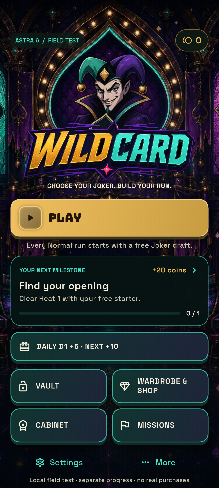
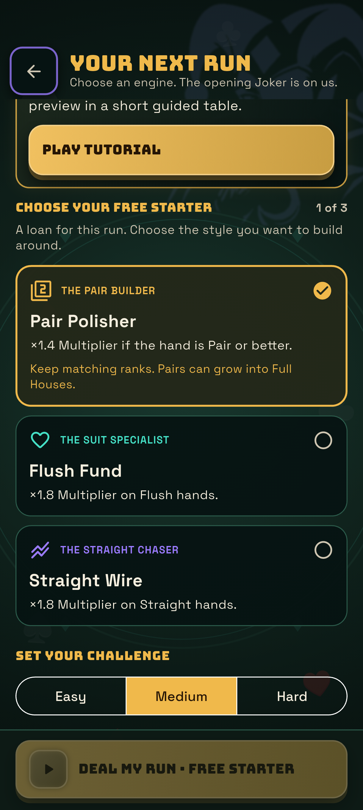
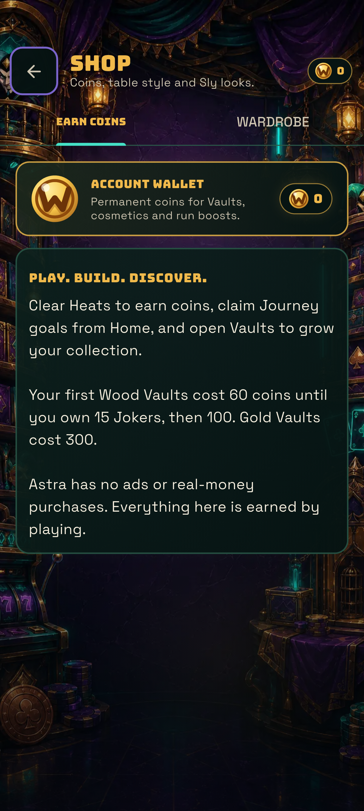

# Astra phone delivery — 5 September 2026 (UK)

## Installed artifact

- WILDCARD Astra **9.0.0, code 73**, ARM64 release build.
- APK source commit: `759d766` on `agent/astra-6-experiment`.
- Package: `com.nisarg.wildcard.astra`.
- SHA-256: `27bdda5cfcd18cc50b38167f77efe2abdffb8792a3374a7df1d0061927a071ad`.
- [Successful build and artifact](https://github.com/nisargpatel0505-lang/wildcard/actions/runs/33926793214).
- Signature verified with the separate Astra experiment certificate. Internet
  and Google Play Billing permissions are absent from the packaged manifest.

Installed successfully on the connected POCO X7 (24095PCADG). A cold Activity
launch returned `Status: ok`. Home, the starter draft and the offline Shop were
visually inspected; readable text and reachable controls were present. The draft
is scrollable under its fixed header with the Deal button retained at the bottom.
The new experiment still requires its tutorial before the first full run.

The phone appeared to be under simultaneous user navigation, so automated taps
were stopped. A full live hand, a full tutorial, chest opening and a complete run
were **not** physically validated in this pass. Do not confuse the widget/engine
tests below with that missing human playtest. No matching Flutter errors or fatal
exceptions were present in the captured 500-line process-filtered log sample.

## Automated evidence

- **13 focused tests passed** in CI: Astra draft, reward ledger/restart,
  no production service calls, zero-cost entry, durable free reroll, Daily
  isolation, no ad-revive dead end, 320/393px presentation, claim navigation lock,
  and Room release-startup protection.
- **31 existing gameplay/account regression tests passed** locally with the
  experiment flag off, covering unchanged baseline behaviour.
- `flutter analyze`: **No issues found**.
- **300 simulation runs**, zero invariant failures. See the separate economy
  report for sample limitations and actual policy results, not human predictions.

## What was preserved

The original phone package `com.nisarg.wildcard` remains **8.5.3, code 72**.
It was not uninstalled, cleared or replaced. No Google Play upload/deployment,
Firebase/backend change, Pi deployment or production signing operation occurred.
The existing phone stay-awake setting was read but not altered.

Protected remote branches still resolve to:

- main: `5a1a0d0f82a6b25415760bc7a77085a4e4fa3dd1`
- Play startup hotfix: `33fa0ab85deb0fc4139478247121cb786b763f81`
- Owner v8.7 prototype: `2d78ea6f44f1d8c520e971ea5d81cc70f39e2b4e`

## Phone screenshots

